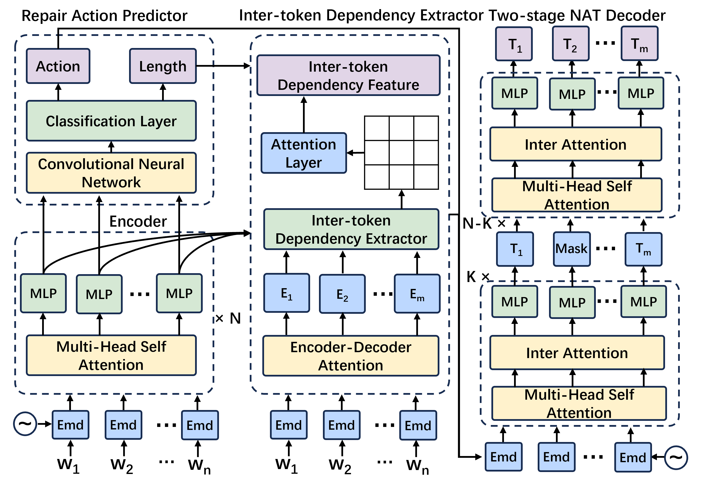

# Speed_Repair
A PyTorch Implementation of paper "Towards Speeding up Program Repair with Non-Autoregressive Model". 
## Introduction
Enlightened by the success of machine learning techniques in various application areas, recent years have witnessed a surge of research efforts on automatic program repair(APR) using machine learning techniques. Previous machine learning-based APR techniques essentially modified bugs in the autoregressive(AR) manner, which predicts future values based on past values. Due to the manner of token-by-token generation, the AR-based APR technique has a huge time delay. In particular, the delay of the APR model with a large number of parameters is more serious. The inability of fast repair negatively impacts the widespread adoption of machine learning-based APR techniques in real-life software development. 

To address the issue, we aim to apply the non-autoregressive(NAR) method to the APR task, which can output target code in a parallel manner to avoid huge repair delays. However, the naive use of the NAR manner for the APR task suffers from the issue of compromised patch quality. To effectively adapt the NAR manner for the APR task, we in this paper propose NARRepair, the first customized NAR code generation model for the APR task. The NARRepair model features three major novelties, including 1) the repair action predictor for alleviating the over-correction issue, 2) the inter-token dependency extractor for alleviating the issue of lacking inter-token dependency information, and 3) the two-stage decoder for
alleviating the issue of lacking contextual information.

We evaluated NARRepair on three widely used datasets in the APR community, and the results show that 1) compared to other APR techniques, the NARRepair model has the best performance within the limited repair time, and 2) compared to AR-based APR techniques, the repair speed of NARRepair has been increased by 1.4-6.4 times in the GPU environment.  Overall, the results show that NARRepair has achieved state-of-the-art comprehensive performance in terms of repair speed and accuracy, highlighting the potential of the NAR model for speeding up program repair.

<div align=center></div>

## Folder Structure
Our code is written based on the Fairseq framework. Here we only describe the files related to the implementation of our model. If you want to know about other files, please refer to Fairseq's documentation[https://fairseq.readthedocs.io/en/latest/index.html]
```
 ├── Dataset: data used to train and test
 ├── fairseq: the code of fairseq frame
     ├──models/nat/narrepair_nonautoregressive_transformer.py: the code of NARRepair model
     ├──parser: the code of generating AST using Tree-Sitter tool
 ├── narrepair: the code of NARRepair
     ├──narrepair/task: the code of task of NARRepair
     ├──narrepair/model: the code of NARRepair model
     ├──narrepair/criterions: the code of criterions of NARRepair
 ├── narutils: Data preprocessing files
 ├── fairseq_cli: post processing files
 ├── repairact.py: get repair action
```
## Requirements
* Conda
  * install conda: [https://conda.io/projects/conda/en/latest/user-guide/install/index.html](https://conda.io/projects/conda/en/latest/user-guide/install/index.html)
  * Create a new conda environment:
      * if you are running with GPU: 
        ```
        conda env create -f environment-gpu.yml
        conda activate narrepair
        ```
        Dependencies include support for CUDA_11.4. If you are using a different CUDA version update the dependencies accordingly.
      * if you are running with CPU:   
        ```
        conda env create -f environment-cpu.yml
        conda activate narrepair
* Dataset
  * Train dataset
      * Training data can be obtained from：[https://github.com/ASSERT-KTH/SelfAPR]
  * Test dataset
      * Install Defect4J from: [https://github.com/rjust/defects4j]
      * Install QuixBugs from: [https://jkoppel.github.io/QuixBugs/]
## Dependency
* Python >= 3.7
* Pytorch >= 1.5.0
* Fairseq >=1.0.0
* Tree-Sitter
* Transformers>=4.10.0
## Main code introduction
In order to allow readers to read the code of our model more accurately, we briefly introduce the main codes corresponding to the model structure.

The NARRepair model mainly consists of four modules: (1)Code Encoder, (2)Repair Action Predictor, (3)Inter-token Dependency Extractor and (4)Two-stage Decoder.
* (1) NARRepair model: the code to implement the NARRepair model is the NARRepair class in the NARRepair/narrepair/models/narrepair.py file
* (2) Code Encoder: this module will use the encoder part of the transformers model that comes with fairseq. Implemented in the NATransformerEncoder class in the fairseq/models/nat/narrepair_nonautoregressive_transformer file.
* (3) Repair Action Predictor: Implemented in the DurationPredictor class in the fairseq/models/nat/narrepair_nonautoregressive_transformer file.
* (4) Inter-token Dependency Extractor:Implemented in the Biaffine class and ast_link function in the fairseq/models/nat/narrepair_nonautodegrasive_transformer file.
* (5) Two-stage Decoder：Implemented in the NATransformerDecoder class in the fairseq/models/nat/narrepair_nonautoregressive_transformer file.
## Preprocess
Preprocessing is divided into two steps: (1) Obtain the repair actions of the training data (2) Convert the data into binary files.
### Obtain the repair actions
We divide all repair actions into: "insert", "delete", "replace", "keep". And we use dynamic programming method to obtain repair actions.
```
python repairact.py
```
### Convert the data into binary files
The data needs to be converted into binary files in order to train the model.

The parameter data_dir represents the data set path, dict_path represents the dictionary path, and destdir represents the binary file path. You can get the content in the picture below
```
data_dir="data storage directory"
dict_path="the location of the dictionary file"
python ./narutils/preprocess.py --source-lang buggy  --target-lang fixed   \
    --task translation \
    --trainpref $TEXT/train --validpref $TEXT/valid \
    --padding-factor 8 \
    --src-with-werdur \
    --destdir defect4j-bin \
    --srcdict ${dict_path} --tgtdict ${dict_path} \
    --workers 60
```
## RQ1: Model Performance
### Train
Use the obtained binaries to train the model. We trained the model on 4 NVIDIA 3090 environments. The following parameters can be modified according to your actual situation.

The parameter bin_data_dir represents the path to the binary file, and save_path represents the path where the trained model is saved.
```
bin_data_dir="preprocessed binary data"
save_path="the storage location of the trained model"
CUDA_VISIBLE_DEVICES=0,1,2,3 python train.py ${bin_data_dir} --arch narrepair --noise full_mask --share-all-embeddings \
    --criterion narrepair_loss --label-smoothing 0.1 --lr 5e-5 --warmup-init-lr 1e-7 --stop-min-lr 1e-9 \
    --lr-scheduler inverse_sqrt --warmup-updates 4000 --optimizer adam --adam-betas '(0.9, 0.999)' \
    --adam-eps 1e-6 --task narrepair_task --max-tokens 50000 --weight-decay 0.01 --dropout 0.1 \
    --encoder-layers 12 --encoder-embed-dim 512 --decoder-layers 12 --decoder-embed-dim 512 --fp16 \
    --max-source-positions 6000 --max-target-positions 6000 --seed 0 --clip-norm 5 \
    --save-dir ${save_path} --src-embedding-copy --length-loss-factor 0.05 --log-interval 100 \
    --eval-bleu --eval-bleu-args '{"iter_decode_max_iter": 0, "iter_decode_with_beam": 1}' \
    --eval-tokenized-bleu --eval-bleu-remove-bpe \
    --maximize-best-checkpoint-metric --decoder-learned-pos --encoder-learned-pos \
    --apply-bert-init --activation-fn gelu --user-dir narrepair --mlm-layers 2 --batch-size 50 --max-epoch 100 \
    --src-with-werdur --werdur-max-predict 100
```

### Inference
During the inference phase, we use the trained model to fix the buggy program. The parameter checkpoint_path represents the storage path of the trained model, and data_dir represents the test data path. Among the inference parameters, the time-limit parameter is used to control the inference time.
```
  checkpoint_path="the storage location of the trained model"
data_dir="the storage location of the test dataset"
src=buggy
tgt=fixed
CUDA_VISIBLE_DEVICES=0 python fairseq_cli/generate.py ${data_dir} --path ${checkpoint_path} \
 --user-dir narrepair --task narrepair_task --remove-bpe --source-lang ${src} \
 --target-lang ${tgt} --max-sentences 20  --iter-decode-max-iter 0 --iter-decode-force-max-iter \
 --iter-decode-eos-penalty 0 --iter-decode-with-beam 200 --gen-subset test --time-limit 30 \
```
### Verify patchs
After obtaining the inference results, we use the ExpressAPR tool [https://github.com/ExpressAPR/ExpressAPR] to verify whether the Java patch is correct. ExpressAPR includes five existing acceleration techniques for mutation testing, including mutant schemata, mutant deduplication, test virtualization, test prioritization, and parallelization. ExpressAPR can significantly improve the speed of patch verification while ensuring the accuracy of verification results.


## RQ2: Ablation Study
In the ablation experiment, we remove specific parts of the model structure separately: (1) Repair Action Predictor, (2) Inter-token Dependency Extractor, (3) Two-stage Decode.
* (1)Repair Action Predictor:  We remove the repair action predictor and instead pass only the repair length to the decoder to observe the impact of repair actions on the results；
* (2)Inter-token Dependency Extractor: We remove the inter-token dependency extractor to observe the impact of inter-token dependency information on the results; 
* (3)Two-stage Decode: We replace the two-stage decoder with a normal NAR decoder to observe the impact of contextual information on the results.
```
├──whole model
  ├──(1)Repair Action Predictor: Please delete lines 164, 186-195, 336-340 in the model/narrepair.py file to clear the repair action information.
  ├──(2)Inter-token Dependency Extractor: fairseq/models/nat/narrepair_nonautoregressive_transformer.py line 519-529 -> return x, {"attn": attn, "inner_states": inner_states} 
  ├──(3)Two-stage Decode: \narrepair\models\narrepair.py delete line 280-290 line 318 -> "out": word_ins_out_first
```
## RQ3: Predicting Repair Actions and Lengths
First，generate the correct repair action and repair length tags.
```
python repairact.py
```
Second, generate the repair actions and repair lengths predicted by the model.
```
checkpoint_path="the storage location of the trained model"
data_dir="the storage location of the test dataset"
src=buggy
tgt=fixed
CUDA_VISIBLE_DEVICES=0 python fairseq_cli/generate.py ${data_dir} --path ${checkpoint_path} \
 --user-dir narrepair --task narrepair_task --remove-bpe --source-lang ${src} \
 --target-lang ${tgt} --max-sentences 20  --iter-decode-max-iter 0 --iter-decode-force-max-iter \
 --iter-decode-eos-penalty 0 --iter-decode-with-beam 200 --gen-subset test  \
```
Third, evaluate the prediction results.
```
python compare.py "real data directory" "predict data directory"
```
## RQ4: Aleviating the Over-Correction Problem
First, obtain the code generated by the model.
```
checkpoint_path="the storage location of the trained model"
data_dir="the storage location of the test dataset"
src=buggy
tgt=fixed
CUDA_VISIBLE_DEVICES=0 python fairseq_cli/generate.py ${data_dir} --path ${checkpoint_path} \
 --user-dir narrepair --task narrepair_task --remove-bpe --source-lang ${src} \
 --target-lang ${tgt} --max-sentences 20  --iter-decode-max-iter 0 --iter-decode-force-max-iter \
 --iter-decode-eos-penalty 0 --iter-decode-with-beam 200 --gen-subset test \
```
Second, compare the model generation results with real repair code and count over-correction tokens.
```
python over_correction.py "real data directory" "generated data directory"
```
## RQ5: The Similarity Between AST Nodes
During the model generation process, the model automatically calculates the similarity between the matrix nodes and the tokens in the code.
```
checkpoint_path="the storage location of the trained model"
data_dir="the storage location of the test dataset"
src=buggy
tgt=fixed
CUDA_VISIBLE_DEVICES=0 python fairseq_cli/generate.py ${data_dir} --path ${checkpoint_path} \
 --user-dir narrepair --task narrepair_task --remove-bpe --source-lang ${src} \
 --target-lang ${tgt} --max-sentences 20  --iter-decode-max-iter 0 --iter-decode-force-max-iter \
 --iter-decode-eos-penalty 0 --iter-decode-with-beam 200 --gen-subset test \
```


